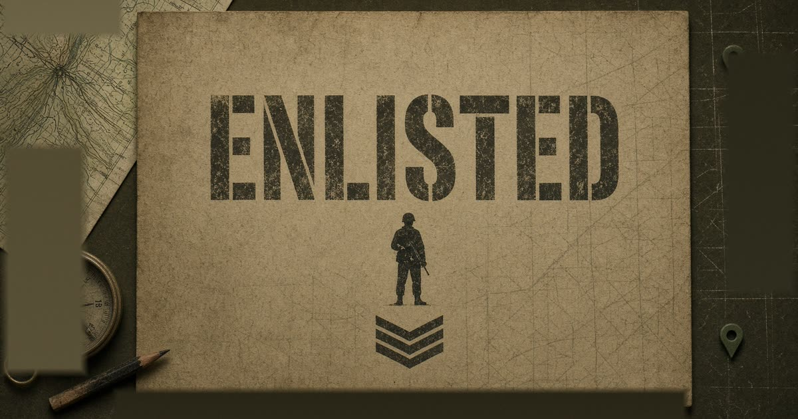
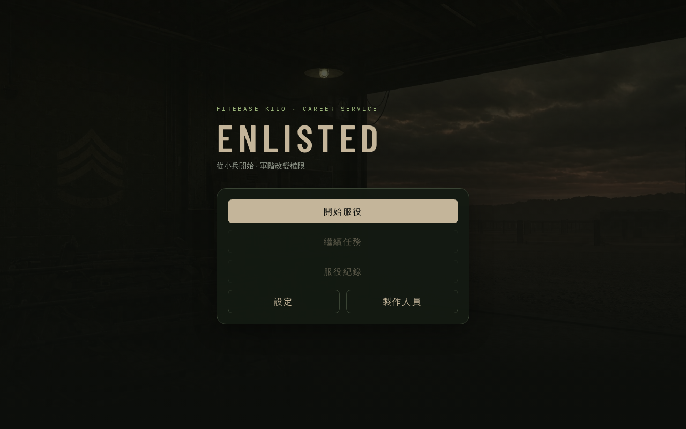
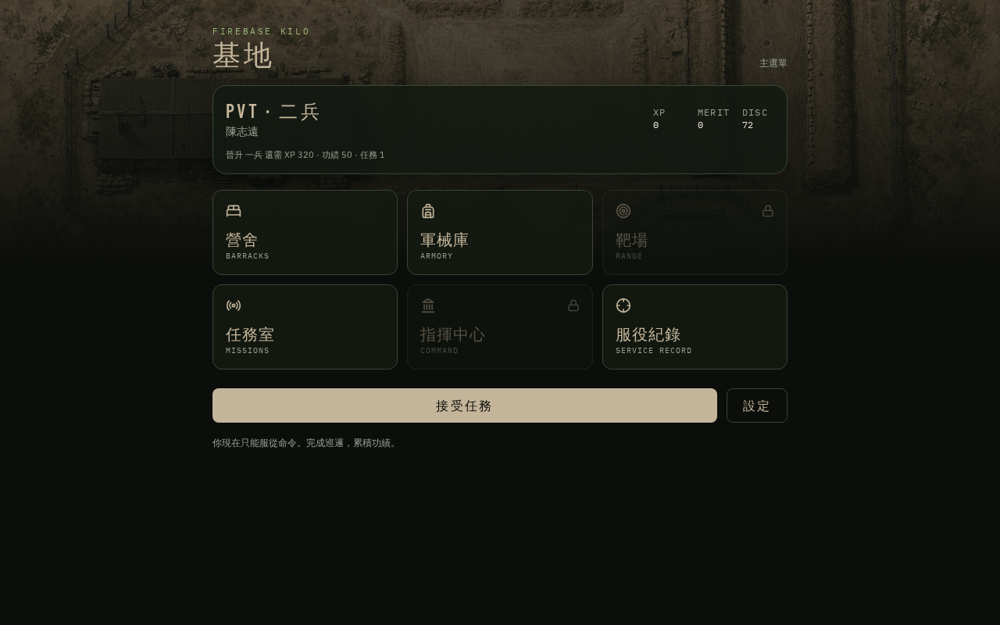
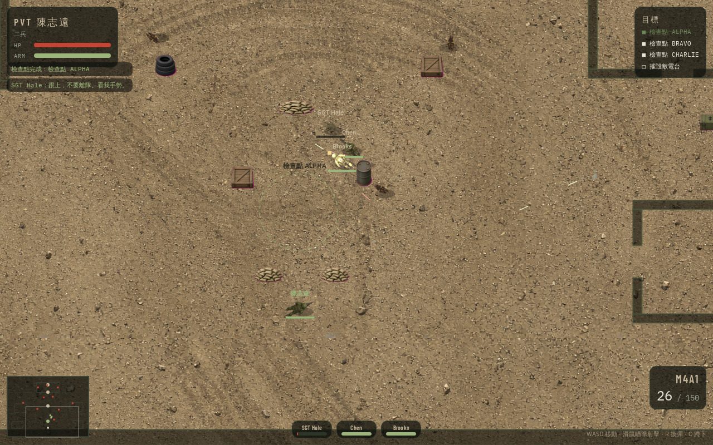
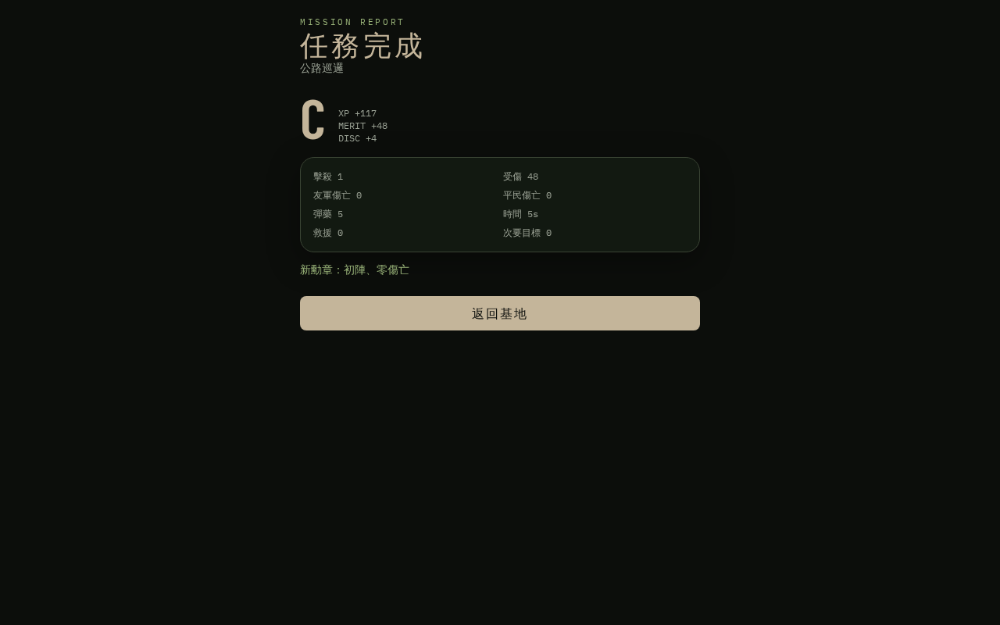

# ENLISTED

[繁體中文](README.md) | **English**

**[Live Demo / 線上展示](https://birch-civic-bolt-wood.grok.me/)**

**From Private to Major** — top-down tactical shooting meets a military career simulator.

Start as a private and work your way up to major. Rank changes how many soldiers you can command, which weapons you can equip, and what fire support you can call in.



[](#tech-stack)
[](#tech-stack)
[](#tech-stack)
[](#tech-stack)

| Menu | Base |
| --- | --- |
|  |  |

| Combat | Debrief |
| --- | --- |
|  |  |

## Gameplay

**Enlist → choose a name and difficulty → visit the base → accept a mission → deploy → move, aim, and shoot → complete objectives → debrief (XP, merit, discipline) → qualify for promotion → save.**

- Nine ranks, from following a squad leader to battalion-level command
- Top-down Canvas combat with cover, squad AI, grenades, and fire support
- Patrol, assault, rescue, defense, and firing-range activities
- Progress saved in browser `localStorage`, so you can resume after refreshing

## Ranks

| Rank | Code | Unlocks |
| --- | --- | --- |
| Private | PVT | M4 / M9 / M870; follow the squad leader |
| Private First Class | PFC | MP5, grenades, firing range |
| Specialist | SPC | M249, specializations |
| Corporal | CPL | Command 2 soldiers, M110 |
| Sergeant | SGT | 4-soldier squad, drone, M24 |
| Second Lieutenant | 2LT | Platoon fire support, AT4, command center |
| First Lieutenant | 1LT | 5-soldier squad, M320, three-round fire-support barrage |
| Captain | CPT | SCAR-H, company fire support |
| Major | MAJ | 6-soldier squad, Javelin, battalion fire support |

Promotions require **XP, merit, discipline, and completed missions**. All requirements must be met.

## Controls

### Keyboard and mouse

| Input | Action |
| --- | --- |
| WASD / arrow keys | Move |
| Mouse / left click | Aim / fire |
| R | Reload |
| C | Crouch |
| G | Grenade (PFC and above) |
| 1–5 | Squad commands (CPL and above) |
| Right click | Mark a movement destination |
| Q | Drone (SGT and above) |
| F | Fire support (2LT and above) |
| Esc | Pause |

**Touch:** use the left stick to move and the right stick to aim and fire.

## Maps and missions

Maps include Highway 7, District 9, River Valley Village, and the firing range.

Missions unlock with rank: Highway Patrol (PVT), Urban Assault, Valley Rescue, Hold the Line, Night Sweep, Flank Search, Company Defense, and Battalion Commander's Resolve.

## Run locally

Requires **Node.js 22+**.

```bash
npm install
npm run dev
```

Open the development server URL in your browser to play.

```bash
npm run build        # Production build
npm run typecheck    # TypeScript checks
```

Career progress is stored in the local browser under `enlisted.career.v1`. You can reset it in Settings.

## Tech stack

- React 19 + TypeScript
- Vite + TanStack Start / Router
- Tailwind CSS v4
- Zustand for career state
- Canvas 2D for combat simulation and rendering
- Web Audio API for synthesized weapon and UI sounds; no external audio files

Core game code lives in `src/game/`:

```text
src/game/
  combat/     Simulation and Canvas rendering
  ui/         Menu, base, armory, missions, and debrief
  ranks.ts    Rank definitions
  weapons.ts  Weapon data
  missions.ts Missions
  maps.ts     Maps and cover
  store.ts    Saves and promotions
```

## License

Personal project / prototype. Assets and code are intended for demonstration and learning only.
